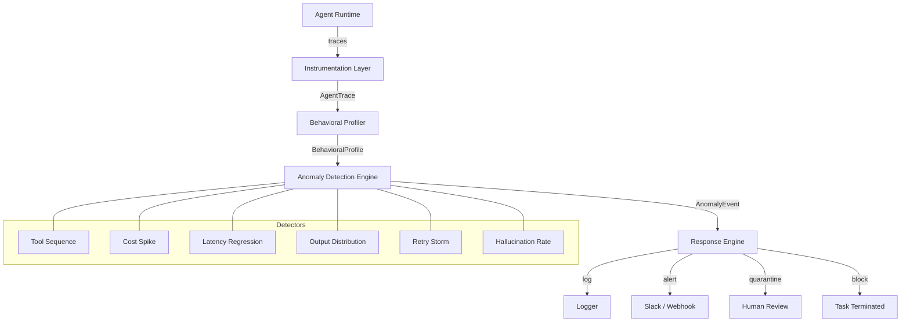

# agentomaly

**Runtime Behavioral Anomaly Detection for AI Agents via OpenTelemetry**

[](https://github.com/sushaan-k/agentomaly/actions)
[](https://pypi.org/project/agentomaly/)
[](https://pypi.org/project/agentomaly/)
[](https://www.python.org/downloads/)
[](https://opentelemetry.io)
[](LICENSE)

*Who watches the watchers?*

---

## At a Glance

- **Behavioral profiling** from historical agent traces
- **Runtime anomaly detection** for tools, sequences, volume, content, and injection
- **Response policies** spanning log, alert, quarantine, and block
- **OpenTelemetry integration** with out-of-the-box backend support (Jaeger, Honeycomb, Datadog, Grafana, AWS X-Ray)
- **LangGraph, MCP, Slack, webhooks, and PagerDuty** integrations

## The Problem

AI agents are being deployed into production at an accelerating rate. But there is a critical blind spot: **nobody is monitoring what these agents actually do**.

Traditional monitoring (Datadog, New Relic, PagerDuty) tracks infrastructure metrics — CPU, memory, latency, error rates. An agent can be running perfectly fine on those metrics while doing something catastrophically wrong:

- Making **unusual tool calls** it has never made before
- Accessing **data it shouldn't need** for the current task
- Taking **50 actions** when similar tasks usually take 10
- Producing **structurally different outputs** from its historical norm
- Being manipulated by **indirect prompt injection** — invisible to infra monitoring

## The Solution

**agentomaly** is a lightweight observability layer that attaches to any AI agent runtime, learns normal behavioral patterns from historical execution traces, and flags anomalies in real-time with statistical rigor. It is security monitoring for the agent era.

## Quick Start

### Installation

```bash
pip install agentomaly
```

### Train a Behavioral Profile

```python
from spectra import Monitor, Profile
from spectra.profiler import ProfileTrainer

# Train from historical execution traces
trainer = ProfileTrainer(min_traces=100)
profile = trainer.train(
    agent_type="customer-support",
    traces=historical_traces,
)

# Save for later
profile.save("customer_support_profile.json")
```

### Monitor an Agent

```python
from spectra import Monitor

profile = Profile.load("customer_support_profile.json")
monitor = Monitor(
    profile=profile,
    sensitivity="medium",
    response_policy={
        "CRITICAL": "block",
        "HIGH": "quarantine",
        "MEDIUM": "alert",
        "LOW": "log",
    },
)
monitor.start()

# Analyze a trace
events = await monitor.analyze(agent_trace)
for event in events:
    print(f"[{event.severity.value}] {event.title} (score={event.score:.2f})")
```

### Instrument Your Agent

```python
import spectra

@spectra.trace(agent_type="customer-support")
async def handle_request(user_message: str) -> str:
    # Your agent code — spectra captures tool calls and LLM usage
    spectra.record_tool_call(tool_name="search_kb", arguments={"q": user_message})
    spectra.record_llm_call(model="gpt-4", total_tokens=1500)
    return "Response"
```

## Architecture



## Anomaly Detectors

| Detector | Metric | Method | Tuning Knob |
|---|---|---|---|
| **Tool Sequence** | Call order distribution | Jensen–Shannon divergence | JS threshold 0.0–1.0 |
| **Cost Spike** | Token spend per run | Rolling z-score | σ threshold |
| **Latency Regression** | P50/P95/P99 step latency | Welch's t-test | p-value + effect size |
| **Output Distribution** | Response length + vocabulary | KL divergence | KL threshold |
| **Retry Storm** | Retry rate per tool | Control chart (Shewhart) | 3σ default |
| **Hallucination Rate** | Postcondition failures | Bernoulli CUSUM | Max run length |

### Detector Descriptions

**Tool Sequence Anomaly**
- Builds a Markov model of normal action sequences and flags deviations
- Novel transitions, low-probability sequences, and loop detection
- **Cost**: O(n) per trace | **Latency**: <5ms | **Output**: sequence likelihood score

**Cost Spike Detection**
- Z-score statistical analysis on token spend and LLM call counts
- Detects spend outliers across runs and correlates with tool usage
- **Cost**: O(1) per trace | **Latency**: <1ms | **Output**: cost anomaly z-score

**Latency Regression**
- Welch's t-test on percentile latencies (P50, P95, P99) vs. baseline
- Flags when individual step latencies exceed control limits
- **Cost**: O(n) | **Latency**: <3ms | **Output**: p-value + effect size

**Output Distribution Anomaly**
- KL divergence on response length and vocabulary distributions
- Detects structural changes in agent outputs (unexpected code blocks, URLs)
- **Cost**: O(n) | **Latency**: <5ms | **Output**: KL divergence score

**Retry Storm Detection**
- Shewhart control chart on per-tool retry rates
- Flags when retries exceed 3σ above baseline
- **Cost**: O(1) | **Latency**: <1ms | **Output**: retry rate anomaly flag + count

**Hallucination Rate Detection**
- Bernoulli CUSUM on postcondition failure rates
- Detects when agents start failing structural assertions or business logic checks
- **Cost**: O(n) | **Latency**: <2ms | **Output**: failure rate + CUSUM signal

## OpenTelemetry Backend Support

| Backend | Traces | Metrics | Logs |
|---|---|---|---|
| **Jaeger** | ✅ | — | — |
| **Honeycomb** | ✅ | ✅ | ✅ |
| **Datadog** | ✅ | ✅ | ✅ |
| **Grafana Tempo** | ✅ | ✅ | ✅ |
| **AWS X-Ray** | ✅ | — | — |
| **OTLP (generic)** | ✅ | ✅ | ✅ |

## Sensitivity Levels

| Level | Z-Score Threshold | Use Case |
|-------|-------------------|----------|
| `low` | 4.0 | Production — minimize false positives |
| `medium` | 3.0 | Balanced monitoring (default) |
| `high` | 2.0 | Elevated security posture |
| `paranoid` | 1.5 | Maximum detection — expect more alerts |

## Alerting & Integration

### Slack

```python
from spectra import Monitor, SlackWebhook

monitor = Monitor(
    profile=profile,
    alert_channels=[
        SlackWebhook("https://hooks.slack.com/services/..."),
    ],
)
```

### Webhooks

```python
from spectra import Monitor, WebhookChannel

monitor = Monitor(
    profile=profile,
    alert_channels=[
        WebhookChannel("https://your-api.com/alerts"),
    ],
)
```

### OpenTelemetry

```python
from spectra.instrumentation import OTelCollector

collector = OTelCollector(service_name="my-agent")
collector.export_trace(agent_trace)
collector.export_anomaly(anomaly_event)
```

### LangGraph

```python
from spectra.instrumentation.langgraph import LangGraphCallback

callback = LangGraphCallback(agent_type="research-agent")
callback.on_tool_start("search", {"query": "test"})
callback.on_tool_end("search", result="Found results")
```

### MCP (Model Context Protocol)

```python
from spectra.instrumentation.mcp import MCPMiddleware

middleware = MCPMiddleware(agent_type="assistant")

@middleware.wrap_tool("file_search")
async def file_search(query: str) -> str:
    ...
```

## CLI

```bash
# Train a profile
spectra train traces.json --agent-type customer-support --output profile.json

# Inspect a profile
spectra inspect profile.json

# Launch the dashboard
spectra dashboard profile.json --port 8400
```

## Project Structure

```
src/spectra/
    __init__.py              # Public API
    models.py                # Pydantic data models
    exceptions.py            # Custom exceptions
    monitor.py               # Main monitoring runtime
    cli.py                   # CLI interface
    instrumentation/
        decorator.py         # @spectra.trace decorator
        otel.py              # OpenTelemetry integration
        mcp.py               # MCP middleware
        langgraph.py         # LangGraph callback
    profiler/
        profile.py           # Behavioral profile
        trainer.py           # Profile training
        markov.py            # Markov chain model
    detectors/
        tool_anomaly.py      # Tool sequence detector
        cost_spike.py        # Cost spike detector
        latency_regression.py # Latency regression detector
        content_anomaly.py   # Output distribution detector
        retry_storm.py       # Retry storm detector
        hallucination.py     # Hallucination rate detector
    response/
        policy.py            # Response policy engine
        alerter.py           # Alert channels
        blocker.py           # Task blocking/quarantine
    dashboard/
        app.py               # FastAPI dashboard
```

## Demo

Run the offline walkthrough with:

```bash
uv run python examples/demo.py
```

For LangGraph, MCP, and custom-agent instrumentation flows, see `examples/`.

## Development

```bash
# Clone and install
git clone https://github.com/sushaan-k/agentomaly.git
cd agentomaly
pip install -e ".[dev]"

# Run tests
pytest tests/ -v

# Lint and format
ruff check src/ tests/
ruff format src/ tests/

# Type check
mypy src/spectra/
```

## Why agentomaly?

1. **New category** — behavioral monitoring for AI agents does not exist as a product
2. **Learns, not rules** — adapts to each agent type from real execution data
3. **Detects injection by effect** — catches prompt injection via behavioral shift, not input scanning
4. **Security + observability** — bridges the gap between security monitoring and agent ops
5. **Production integrations** — OpenTelemetry, Slack, LangGraph, MCP out of the box
6. **Statistically rigorous** — uses Jensen–Shannon divergence, Welch's t-test, KL divergence, and Shewhart charts

## Contributing

Contributions are welcome. Please open an issue first to discuss what you'd like to change.

1. Fork the repository
2. Create a feature branch (`git checkout -b feat/amazing-feature`)
3. Commit your changes (`git commit -m 'feat: add amazing feature'`)
4. Push to the branch (`git push origin feat/amazing-feature`)
5. Open a Pull Request

Please ensure tests pass and code is formatted with `ruff format` before submitting.

## License

MIT License. See [LICENSE](LICENSE) for details.
